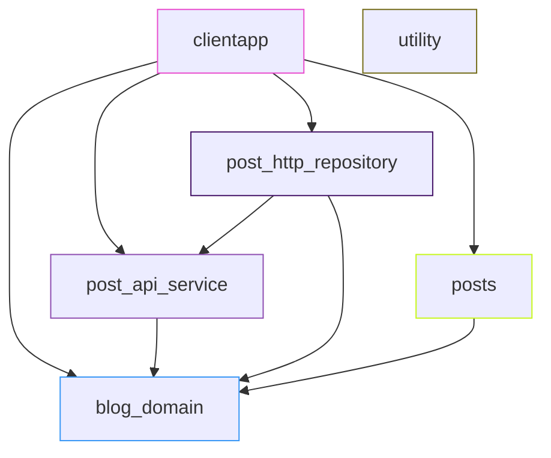

# flutterhttpclient
simple http test app

## concept

App has currently single domain, blogging.
If needed additional domains could be used in single app.

App is composed from features.
Posts is a feature, which uses blogging domain data types and repositories.

Blogging domain has different data types.
Data types are concrete immutable classes.

Domain data types may have their own repositories.
Domain contains interfaces of repositories.

Repositories are implemented on their own packages.
Each repository implements single domain interface.

Services access API's of external systems.
Repositories use api's and convert Api's data types to domain model when necessary.

## principles

Immutable data is used as much as possible.
Code generation is used to generate data types.

Features contain pages, views and state management.
State and events of state management are immutable and they are generated.

Rest api is defined using annotations.
Annotations help to generate code for api.

## data sources

Ready restful api is used

https://jsonplaceholder.typicode.com/

https://github.com/typicode/jsonplaceholder

Documentation of API is at 

https://jsonplaceholder.typicode.com/guide/

## endpoints

endpoints

- /posts
- /posts/<id>

## entities

- post

```json
{
    id: 1,
    title: 'foo',
    body: '...',
    userId: 1
}
```

## packages used

- dart
- flutter
- freezed_annotation
- json_serializable
- bloc
- chopper
- json_serializable_chopper_converter
- get_it

## generators

- freezed
- chopper_generator
- build_runner

## tools

- vgv cli
- melos
- fvm (optional)

## documentation

- markdown
- mermaid
- plantuml

## editors

- android studio
- mermaidflow app

## plugins

- github copilot
- compose (experimental) markdown plugin

## repository

- hosted at github.com (public)
- monorepo
- apps at /apps
- packages at /packages

## workspace

- dart workspace used
- repository root is workspace root 
- workspace root has name "_"
- workspace includes /apps and /packages
- each app and package has resolution:workspace at pubspec.yaml
- workspaces are required for melos 7.x

## task runner

- melos as task runner
- required definitions at melos.yaml
- scripts at pubspec.yaml

## directory structure

creating empty directories

```bash
mkdir apps
mkdir packages
cd packages
mkdir common
mkdir features
mkdir repositories
mkdir domain
mkdir services
tree
```

result

```plaintext

├── apps
├── LICENSE
├── packages
│   ├── common
│   ├── domain
│   ├── features
│   ├── repositories
│   └── services
└── README.md
```

## setup of tools

```bash
# install vgv cli
dart pub global activate very_good_cli
```

```bash
# install melos
dart pub global activate melos
```

```bash
# install melos
dart pub global activate fvm
```

## creation of skeletons

apps are typically flutter_app artifacts

```bash
# create app
very_good create flutter_app <app_name> --description "<app_description>" --org-name "<org_domain>"

# help with
very_good create flutter_app -h

# here 
very_good create flutter_app clientapp --description "http client app" --org-name "com.jukkanikki"
```

features are typically flutter_package artifacts

```bash
# create flutter package
very_good create flutter_package <package_name> --description "<package_description>" 

# help with
very_good create flutter_package -h

# here 
very_good create flutter_package posts --description "posts feature"
```

repositories are typically dart_package artifacts

```bash
# create dart package
very_good create dart_package <package_name> --description "<package_description>"

# help with
very_good create dart_package -h

# here 
very_good create dart_package post_http_repository --description "post http repository"
very_good create dart_package post_api_service --description "post http api"
very_good create dart_package blog_domain --description "blog domain" 
very_good create dart_package utility --description "utility" 
```

## modules




## model generation

- packages/domain/blog_domain/lib/src/model/post.dart

- model is part of domain
- model is immutable data class
- model is generated using freezed package
- code generation using build_runner
- json serialization using json_serializable package

## api generation

- packages/services/post_api_service/lib/src/service/post_api_service.dart

- api is defined using chopper package
- annotations define api endpoints and http methods
- api implementation is generated using chopper generator
- code generation using build_runner
- json conversion using specialized chopper json converter
- freezed annotations used for model generation contain json serialization info

json conversion package

- https://pub.dev/packages/json_serializable_chopper_converter

## ci/cd

github actions

- located at ".github" directory
- created for each directory as in template
- needs to be copied from "/apps/clientapp" to root and adjusted
- main.yaml renamed to clientapp.yaml
- path adjusted to find sources
- rules relaxed and made explicitly (defaults overridden)

at the end checked that they run 

- https://github.com/nikkijuk/flutterhttpclient/actions

## run configurations

### android studio

- run configurations are at ".idea/runConfigurations" directory
- run configurations are xml files
- run configurations are created when app is created using vgv cli
- run configurations needs to be copied from "/apps/clientapp" to root and adjusted

note: 

- there seems be mechanism to overwrite existing run configurations in android studio
- this seems to happen at checkout of branch
- be careful not to overwrite existing run configurations

### vscode

- run configurations are at ".vscode/launch.json" file
- run configurations are json file
- run configurations are created when app is created using vgv cli
- run configurations needs to be copied from "/apps/clientapp" to root and adjusted